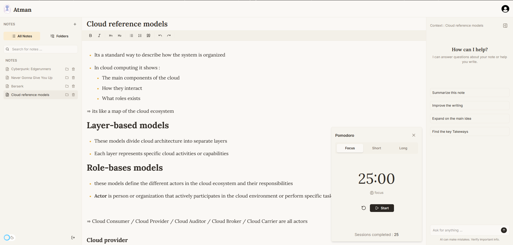
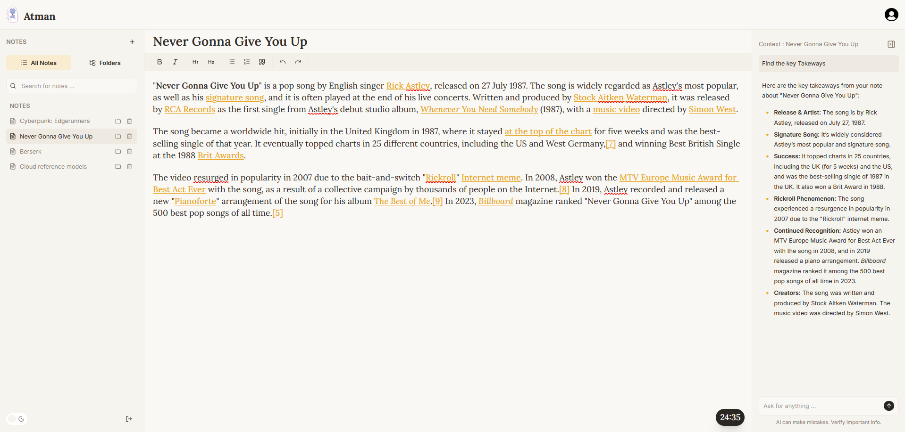
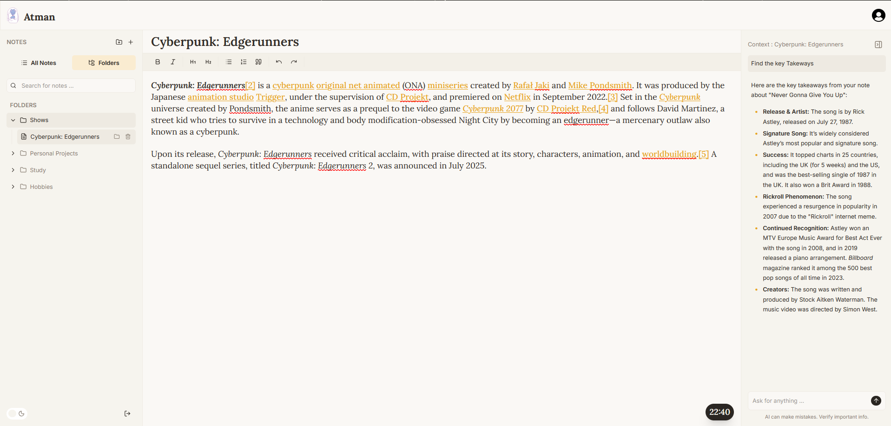
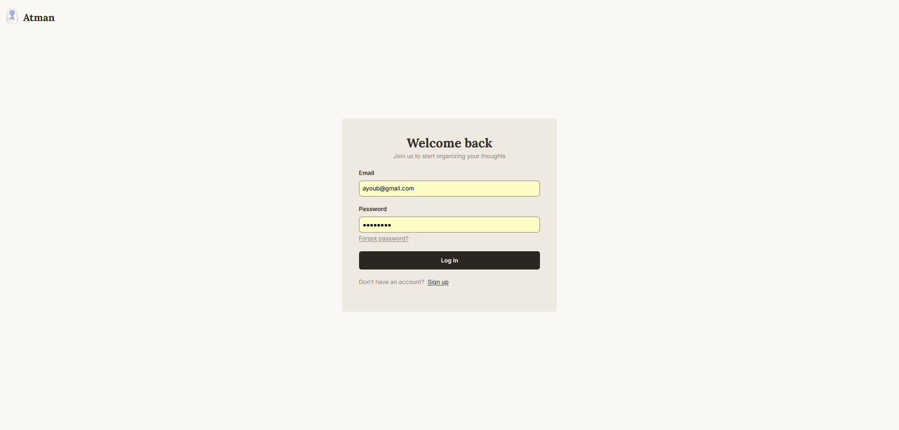

# Atman


Atman is a high-performance, full-stack productivity tool built to centralize your workflow. It combines a robust rich-text editor, integrated time tracking, and AI-driven assistance into a single, seamless dashboard, eliminating the need to toggle between multiple applications.

> **Note:** This project is currently in its **MVP (Minimum Viable Product)** phase, focusing on core stability and cross-device synchronization.

<table>
  <tr>
        <td align="center">
            
        </td>
        <td align="center">
            
        </td>
    </tr>
  <tr>
        <td align="center">
             
        </td>
            <td align="center">
             
        </td>
    </tr>
</table>

## Features (MVP)

- [x] **Secure Authentication:** Full auth flow including JWT-based Access and Refresh tokens for persistent, secure sessions.
- [x] **Core Notes Management:** Create, read, update, and delete notes with instant UI feedback and optimistic updates.
- [x] **Smart Auto-Save:** Never lose a thought. Notes are automatically persisted in the background as you type.
- [x] **Note Categorization:** Tags and folders for advanced organization.
- [x] **Pomodoro Timer:** Integrated focus sessions with customizable work-rest intervals to boost productivity.
- [x] **AI-Powered Explainer:** Integrated AI to summarize long notes or explain complex topics within your entries.
- [x] **User Profiles:** Customizable user settings, and account management.
- [x] **Shared Notes:** Collaborative workspaces featuring real-time sharing.

## Roadmap (Upcoming Features)
- [ ] **Rich Text Support:** Markdown support for better note formatting.

## Installation (Run Locally)

### 1. Prerequisites

Ensure you have **Docker** and **Docker Compose** installed.

### 2. Setup

**1. Clone the repository:**

```bash
git clone https://github.com/ayoubchwt/atman.git
cd atman
git checkout local
```

**2. Configure Environment:** Each part of the app has its own `.env.example` file. Copy and fill in both:

```bash
cp client/.env.example client/.env
cp server/.env.example server/.env
```

`client/.env`:
```
VITE_API_URL=http://localhost:5000/api
```

`server/.env`:
```
PORT=5000
MONGODB_URI=mongodb://mongodb:27017/Atman

JWT_SECRET=your_placeholder_secret_change_me
JWT_EXPIRATION="15m"
REFRESH_EXPIRATION="7d"
SALT_ROUNDS=10

NODE_ENV="development"
CLIENT_URL=http://localhost:5173
```

**3. Launch the Stack:**

```bash
docker-compose up --build
```

* Frontend: `http://localhost:5173`
* API Server: `http://localhost:5000`

## Tech Stack

* **Frontend:** React (Vite), Tailwind CSS, Nginx
* **Backend:** Node.js, Express, TypeScript (NodeNext)
* **Database:** MongoDB
* **Infrastructure:** Docker, Docker Compose

## Contributing

This is an MVP, and contributions are welcome to help move features from the roadmap to production!

1. Fork the Project.
2. Create your Feature Branch (`git checkout -b feature/AmazingFeature`).
3. Commit your Changes (`git commit -m 'Add some AmazingFeature'`).
4. Push to the Branch (`git push origin feature/AmazingFeature`).
5. Open a Pull Request.

## License

Distributed under the MIT License. See `LICENSE` for more information.

[](https://opensource.org/licenses/MIT)
